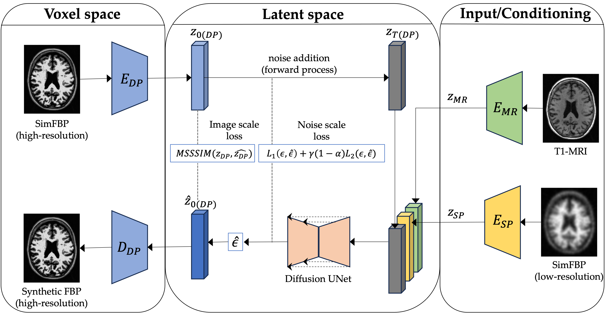
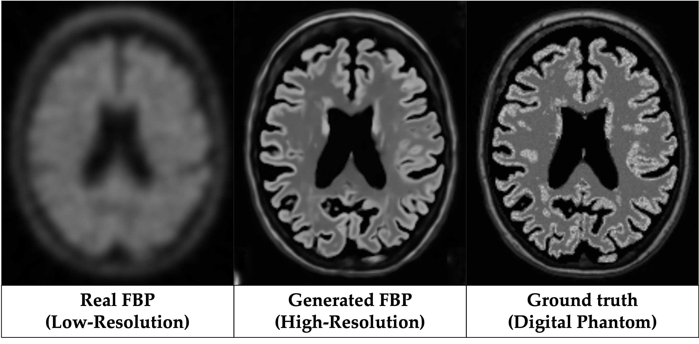

# Latent Diffusion Model for PET Resolution Recovery (LDM-RR)
[Enhancing Amyloid PET Quantification: MRI-guided Super-Resolution using Latent Diffusion Models](https://www.mdpi.com/2075-1729/14/12/1580)\
*Life 2024*, Special Issue: Alzheimer’s Disease: Recent Developments in Pathogenesis, Diagnosis, and Therapy

## Overview
A novel approach to improve Amyloid quantification and address partial volume effect (PVE) in PET using MRI-guided super-resolution with latent diffusion model. The diffusion model is trained on synthetic data simulated from real MRI scans using PET imaging physics.



### Qualitative Results


This repository contains:

- An inference script `./generate.py` to synthesize high-resolution FBP scans given an input low-resolution FBP scan and matching T1w MRI scan.
- Trained model checkpoints in `./checkpoints` and a sample FBP and T1w MRI scan `./samples` directory.
- Training scripts in `./src` to train modality-specific AutoEncoderKL (compression) models and a latent diffusion model (LDM) for super-resolution.

## 🛠️ Requirements and Installation
* Python >= 3.10
* Pytorch == 2.4.1
* CUDA Version >= 12.6
You can use LDMRR.yaml to create the conda environment. Or you can use requirements.txt to install the used packages. 
```
conda env remove --name ldmrr python=3.10 -y
conda activate ldmrr
pip3 install -r requirements.txt
```
Instructions to install MONAI can also be found [here](https://docs.monai.io/en/stable/installation.html) and the appropriate version of Pytorch using [locally](https://docs.monai.io/en/stable/installation.html).

## Dataset
You should structure your dataset in the following way, where `images` contain low-resolution images, `mrs` contain matching MRI scans and `targets` contain ground-truth high-resolution scans (digital phantoms here). For an example checkout `./src/spdp_fbp` folder. All modality images are 256x256x256 in dimensions (sample images for reference in `./src/sample` directory).
```
dataset/
  ├── train
    ├──images
      ├──xxx.nii.gz
      ├──...
  ├── val
    ├──mrs
      ├──yyy.nii.gz
      ├──...
  ├── test
    ├──targets
      ├──zzz.nii.gz
      ├──...
```
## Inference
Training and inference scripts are in `./src` folder. Sample inputs `./sample` and generated outputs `./results` are also provided.  
```bash
python3 generate.py --input_folder ./sample --output_folder ./results
```

## Training 
To train the compression models:  
```bash
python3 train_autoencoderKL.py --dataset /path/to/data --modality sp --epochs 60 --batch_size 2 
```
Use modality = [sp, dp, or mr] to train models for simulated PET (low-res), digital phantom (high-res), and MRI (high-res), respectively. 

For training the latent diffusion model:
```bash
python3 train_ldm_fbp_sp2dp.py --dataset /path/to/data --modality sp --epochs 60 --batch_size 2 
```

## Citation

If you find anything in the paper or repository useful, please consider citing:

```
@article{shah2024enhancing,
  title={Enhancing Amyloid PET Quantification: MRI-Guided Super-Resolution Using Latent Diffusion Models},
  author={Shah, Jay and Che, Yiming and Sohankar, Javad and Luo, Ji and Li, Baoxin and Su, Yi and Wu, Teresa and Alzheimer’s Disease Neuroimaging Initiative},
  journal={Life},
  volume={14},
  number={12},
  pages={1580},
  year={2024},
  publisher={MDPI}
}
```
## Acknowledgments
This work is supported by the National Institute on Aging (NIA) grant RF1AG073424, P30AG072980, the Arizona Department of Health Services (ADHS) and the state of Arizona (ADHS Grant No. CTR057001).
______________________
Feel free to reach out in case of any queries [jayshah.me](http://jayshah.me/)
